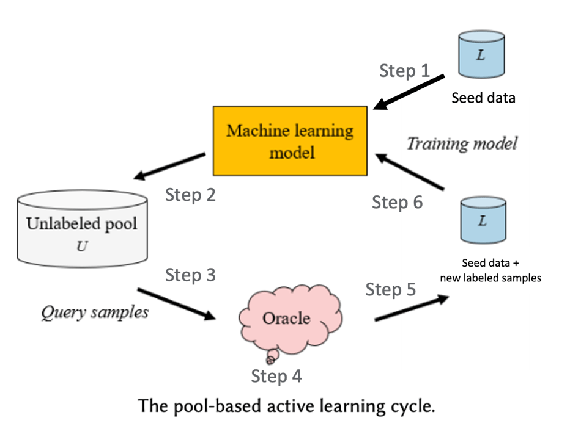

# SeqAL

<!-- <p align="center">
  <a href="https://github.com/BrambleXu/seqal/actions?query=workflow%3ACI">
    
  </a>
  <a href="https://seqal.readthedocs.io">
    
  </a>
  <a href="https://codecov.io/gh/BrambleXu/seqal">
    
  </a>
</p> -->
<p align="center">
  <a href="https://github.com/BrambleXu/seqal/actions?query=workflow%3ACI">
    
  </a>
  <a href="https://python-poetry.org/">
    
  </a>
  <a href="https://github.com/ambv/black">
    
  </a>
  <a href="https://github.com/pre-commit/pre-commit">
    
  </a>
</p>
<p align="center">
  <a href="https://pypi.org/project/seqal/">
    
  </a>
  
  
</p>

SeqAL is a sequence labeling active learning framework based on Flair.

## Installation

Install this via pip (or your favourite package manager):

`pip install seqal`


## Usage

To understand what SeqAL can do, we first introduce the pool-based active learning cycle.



- Step 0: Prepare seed data (a small number of labeled data used for training)
- Step 1: Train the model with seed data
  - Step 2: Predict unlabeled data with the trained model
  - Step 3: Query informative samples based on predictions
  - Step 4: Annotator (Oracle) annotate the selected samples
  - Step 5: Input the new labeled samples to labeled dataset
  - Step 6: Retrain model
- Repeat step2~step6 until the f1 score of the model beyond the threshold or annotation budget is no left

SeqAL can cover all steps except step 0 and step 4. Below is a simple script to demonstrate how to use SeqAL to implement the work flow. Besides, you can see [examples](./examples) for more detail.

```python
from seqal.active_learner import ActiveLearner
from seqal.samplers import LeastConfidenceSampler
from seqal.utils import add_tags
from seqal.datasets import ColumnCorpus
from seqal.utils import load_plain_text
from xxxx import annotate_by_human  # User need to prepare this method


# Step 0: Preparation
## Prepare Seed data, valid data, and test data
columns = {0: "text", 1: "pos", 2: "syntactic_chunk", 3: "ner"}
data_folder = "./datasets/conll"
corpus = ColumnCorpus(
    data_folder,
    columns,
    train_file="train_seed.txt",
    dev_file="valid.txt",
    test_file="test.txt",
)

## Unlabeled data pool
file_path = "./datasets/conll/train_datapool.txt"
unlabeled_sentences = load_plain_text(file_path)

## Initilize ActiveLearner
learner = ActiveLearner(
  tagger_params=tagger_params,   # Model parameters (hidden size, embedding, etc.)
  query_strategy=LeastConfidenceSampler(),  # Query algorithm
  corpus=corpus,                 # Corpus contains training, validation, test data
  trainer_params=trainer_params  # Trainer parameters (epoch, batch size, etc.)
)

# Step 1: Initial training on model
learner.initialize()

# Step 2&3: Predict on unlabeled data and query informative data
_, queried_samples = learner.query(data_pool)
queried_samples = [{"text": sent.to_plain_string()} for sent in queried_samples]  # Convert sentence class to plain text
# queried_samples:
# [
#   {
#     "text": "I love Berlin"
#   }
# ]

# Step 4: Annotator annotate the selected samples
new_labels = annotate_by_human(queried_samples)
# new_labels:
# [　
#   {
#     "text": "I love Berlin .",
#     "labels": [  # The labels created by annotators
#       {
#         "start_pos": 7,
#         "text": "Berlin",
#         "label": "S-LOC"
#       }
#     ]
#   }
# ]

## Convert data to Sentence class
new_labeled_samples = add_tags(new_labels)

# Step 5&6: Add new labeled samples to training and retrain model
learner.teach(new_labeled_samples)
```

The [usage](./docs/source/usage.md) page has more detail on parameter setup and method explanations.


## Performance

Active learning algorithms achieve 97% performance of the best deep model trained on full data using only 30%% of the training data on the CoNLL 2003 English dataset.

See [performance.md](./docs/source/performance.md) for detail.


## Construct envirement locally

If you want to make a PR or implement something locally, you can follow bellow instruction to construct the development envirement locally.

First we create a environment "seqal" based on the `environment.yml` file.

We use conda as envirement management tool, so install it first.

```
conda env create -f environment.yml
```

Then we activate the environment.

```
conda activate seqal
```

Install poetry for dependency management.

```
curl -sSL https://raw.githubusercontent.com/python-poetry/poetry/master/get-poetry.py | python -
```

Add poetry path in your shell configure file (`bashrc`, `zshrc`, etc.)
```
export PATH="$HOME/.poetry/bin:$PATH"
```

Installing dependencies from `pyproject.toml`.

```
poetry install
```

You can make development locally now.

If you want to delete the local envirement, run below command.
```
conda remove --name seqal --all
```

## Contributors ✨

Thanks goes to these wonderful people ([emoji key](https://allcontributors.org/docs/en/emoji-key)):

<!-- ALL-CONTRIBUTORS-LIST:START - Do not remove or modify this section -->
<!-- prettier-ignore-start -->
<!-- markdownlint-disable -->
<!-- markdownlint-enable -->
<!-- prettier-ignore-end -->
<!-- ALL-CONTRIBUTORS-LIST:END -->

This project follows the [all-contributors](https://github.com/all-contributors/all-contributors) specification. Contributions of any kind welcome!

## Credits

- [Cookiecutter](https://github.com/audreyr/cookiecutter)
- [browniebroke/cookiecutter-pypackage](https://github.com/browniebroke/cookiecutter-pypackage)
- [flairNLP/flair](https://github.com/flairNLP/flair)
- [modal](https://github.com/modAL-python/modAL)
