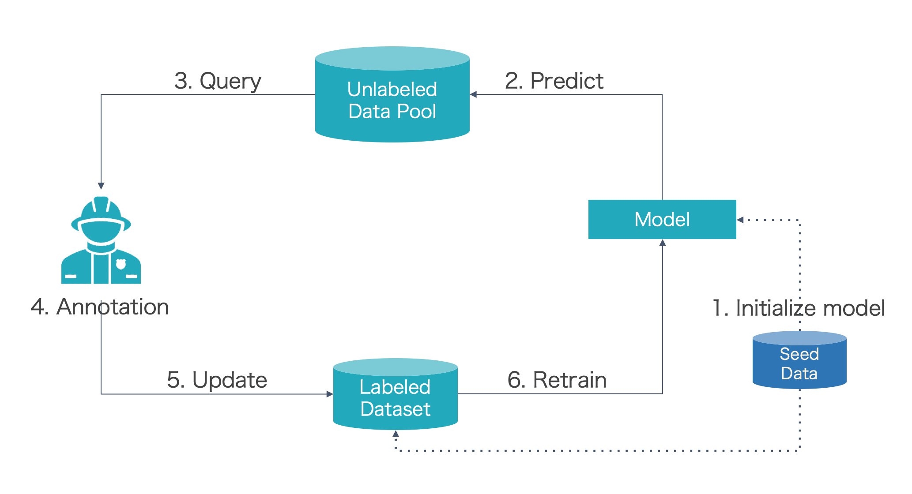

# SeqAL

<!-- <p align="center">
  <a href="https://codecov.io/gh/BrambleXu/seqal">
    
  </a>
</p> -->
<p align="center">
  <a href="https://tech-sketch.github.io/SeqAL/">
    
  </a>
  <a href="https://github.com/BrambleXu/seqal/actions?query=workflow%3ACI">
    
  </a>
  <a href="https://python-poetry.org/">
    
  </a>
  <a href="https://github.com/ambv/black">
    
  </a>
  <a href="https://github.com/pre-commit/pre-commit">
    
  </a>
</p>
<p align="center">
  <a href="https://pypi.org/project/seqal/">
    
  </a>
  
  
</p>

SeqAL is a sequence labeling active learning framework based on Flair.

## Installation

SeqAL is available on PyPI:

```bash
pip install seqal
```

SeqAL officially supports Python 3.8+.

## Usage

To understand what SeqAL can do, we first introduce the pool-based active learning cycle.



- Step 0: Prepare seed data (a small number of labeled data used for training)
- Step 1: Train the model with seed data
  - Step 2: Predict unlabeled data with the trained model
  - Step 3: Query informative samples based on predictions
  - Step 4: Annotator (Oracle) annotate the selected samples
  - Step 5: Input the new labeled samples to labeled dataset
  - Step 6: Retrain model
- Repeat step2~step6 until the f1 score of the model beyond the threshold or annotation budget is no left

SeqAL can cover all steps except step 0 and step 4. Because there is no 3rd part annotation tool, we can run below script to simulate the active learning cycle.

```bash
python examples/run_al_cycle.py \
  --text_column 0 \
  --tag_column 1 \
  --data_folder ./data/sample_bio \
  --train_file train_seed.txt \
  --dev_file dev.txt \
  --test_file test.txt \
  --pool_file labeled_data_pool.txt \
  --tag_type ner \
  --hidden_size 256 \
  --embeddings glove \
  --use_rnn False \
  --max_epochs 1 \
  --mini_batch_size 32 \
  --learning_rate 0.1 \
  --sampler MaxNormLogProbSampler \
  --query_number 2 \
  --token_based False \
  --iterations 5 \
  --research_mode True
```

Parameters:
- Dataset setup:
  -`text_column`: which column is text in CoNLL format.
  -`tag_column`: which column is tag in CoNLL format.
  -`data_folder`: the folder path of data.
  -`train_file`: file name of training (seed) data.
  -`dev_file`: file name of validation data.
  -`test_file`: file name of test data.
  -`pool_file`: file name of unlabeled data pool data.

- Tagger (model) setup:
  -`tag_type`: tag type of sequence, "ner", "pos" etc.
  -`hidden_size`: hidden size of model
  -`embeddings`: embedding type
  -`use_rnn`: if true, use Bi-LSTM CRF model, else CRF model.

- Training setup
  -`max_epochs`: number of epochs in each round for active learning.
  -`mini_batch_size`: batch size.
  -`learning_rate`: learning rate.

- Active learning setup
  -`sampler`: sampling method, "LeastConfidenceSampler", "MaxNormLogProbSampler", etc.
  -`query_number`: number of data to query in each round.
  -`token_based`: if true, count data number as token based, else count data number on sentence based.
  -`iterations`: number of active learning round.
  -`research_mode`: if true, simulate the active learning cycle with real labels, else with predicted labels.

More explanations about the parameters in the tutorials.

You can find the script in `examples/run_al_cycle.py` or `examples/active_learning_cycle_research_mode.py`. If you want to connect SeqAL with an annotation tool, you can see the script in `examples/active_learning_cycle_annotation_mode.py`.


## Tutorials

We provide a set of quick tutorials to get you started with the library.

- [Tutorials on Github Page](https://tech-sketch.github.io/SeqAL/)
- [Tutorials on Markown](./docs/)
  - [Tutorial 1: Introduction](./docs/TUTORIAL_1_Introduction.md)
  - [Tutorial 2: Prepare Corpus](./docs/TUTORIAL_2_Prepare_Corpus.md)
  - [Tutorial 3: Active Learner Setup](./docs/TUTORIAL_3_Active_Learner_Setup.md)
  - [Tutorial 4: Prepare Data Pool](./docs/TUTORIAL_4_Prepare_Data_Pool.md)
  - [Tutorial 5: Research and Annotation Mode](./docs/TUTORIAL_5_Research_and_Annotation_Mode.md)
  - [Tutorial 6: Query Setup](./docs/TUTORIAL_6_Query_Setup.md)
  - [Tutorial 7: Annotated Data](./docs/TUTORIAL_7_Annotated_Data.md)
  - [Tutorial 8: Stopper](./docs/TUTORIAL_8_Stopper.md)
  - [Tutorial 9: Output Labeled Data](./docs/TUTORIAL_9_Output_Labeled_Data.md)
  - [Tutorial 10: Performance Recorder](./docs/TUTORIAL_10_Performance_Recorder.md)
  - [Tutorial 11: Multiple Language Support](./docs/TUTORIAL_11_Multiple_Language_Support.md)

## Performance

Active learning algorithms achieve 97% performance of the best deep model trained on full data using only 30% of the training data on the CoNLL 2003 English dataset. The CPU model can decrease the time cost greatly only sacrificing a little performance.

See [performance](./docs/performance.md) for more detail about performance and time cost.

## Contributing

If you have suggestions for how SeqAL could be improved, or want to report a bug, open an issue! We'd love all and any contributions.

For more, check out the [Contributing Guide](./CONTRIBUTING.md).

## Credits

- [Cookiecutter](https://github.com/audreyr/cookiecutter)
- [browniebroke/cookiecutter-pypackage](https://github.com/browniebroke/cookiecutter-pypackage)
- [flairNLP/flair](https://github.com/flairNLP/flair)
- [modal](https://github.com/modAL-python/modAL)
