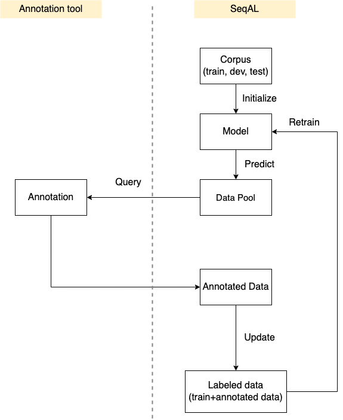

# Introduction

This tutorial shows how to use SeqAL to perform active learning cycle for NER(named entity recognition).



We will use the below example to explain the SeqAL usage.

```python
from flair.embeddings import WordEmbeddings

from seqal.active_learner import ActiveLearner
from seqal.datasets import ColumnCorpus, ColumnDataset
from seqal.samplers import LeastConfidenceSampler
from seqal.utils import load_plain_text, add_tags

# 1. get the corpus
columns = {0: "text", 1: "ner"}
data_folder = "./data/conll"
corpus = ColumnCorpus(
    data_folder,
    columns,
    train_file="train_seed.txt",
    dev_file="valid.txt",
    test_file="test.txt",
)

# 2. tagger params
tagger_params = {}
tagger_params["tag_type"] = "ner"
tagger_params["hidden_size"] = 256
embeddings = WordEmbeddings("glove")
tagger_params["embeddings"] = embeddings
tagger_params["use_rnn"] = False

# 3. trainer params
trainer_params = {}
trainer_params["max_epochs"] = 1
trainer_params["mini_batch_size"] = 32
trainer_params["learning_rate"] = 0.1
trainer_params["patience"] = 5

# 4. setup active learner
sampler = LeastConfidenceSampler()
learner = ActiveLearner(corpus, sampler, tagger_params, trainer_params)

# 5. initialize active learner
learner.initialize(dir_path="output/init_train")

# 6. prepare data pool
file_path = "./datasets/conll/train_pool.txt"
unlabeled_sentences = load_plain_text(file_path)

# 7. query setup
query_number = 10
token_based = False
iterations = 5

# 8. iteration
for i in range(iterations):
    # 9. query unlabeled sentences
    queried_samples, unlabeled_sentences = learner.query(
        unlabeled_sentences, query_number, token_based=token_based, research_mode=False
    )

    # 10. annotate data
    annotated_data = human_annotate(queried_samples)

    # 11. retrain model with newly added queried_samples
    queried_samples = add_tags(annotated_data)
    learner.teach(queried_samples, dir_path=f"output/retrain_{i}")
```


## 1 Load Corpus

First, we need to prepare small labeled data (seed data), which can be split into training data, validation data, and test data.

```python
columns = {0: "text", 1: "ner"}
data_folder = "./data/conll"
corpus = ColumnCorpus(
    data_folder,
    columns,
    train_file="train_seed.txt",
    dev_file="valid.txt",
    test_file="test.txt",
)
```

For such data, we import the `ColumnCorpus` class and provide a `columns` variable to specify which column is the name entity tag.

The `train_seed.txt` is the dataset used to train the model. The `dev.txt` is the dataset used to give an estimate of model skill while tuning the model’s hyperparameters. The `test.txt` is the dataset used to give an unbiased estimate of the final tuned model.

Related tutorial: [Prepare Corpus](./TUTORIAL_2_Prepare_Corpus.md)


## 2~5 Initialize Active Learner

```python
# 2. tagger params
tagger_params = {}
tagger_params["tag_type"] = "ner"
tagger_params["hidden_size"] = 256
embeddings = WordEmbeddings("glove")
tagger_params["embeddings"] = embeddings

# 3. trainer params
trainer_params = {}
trainer_params["max_epochs"] = 1
trainer_params["mini_batch_size"] = 32
trainer_params["learning_rate"] = 0.1
trainer_params["patience"] = 5

# 4. setup active learner
sampler = LeastConfidenceSampler()
learner = ActiveLearner(corpus, sampler, tagger_params, trainer_params)

# 5. initialize active learner
learner.initialize(dir_path="output/init_train")
```

To set up an active learner, we have to provide `corpus`, `sampler`, `tagger_params`, and `trainer_params`. The `sampler` means the sampling method. The `tagger_params` means model parameters. The default model is Bi-LSTM CRF. The `trainer_params` control the training process.

After the setup, we can initialize the learner by calling `learner.initialize`. This will first train the model from scratch. The training log and model will be saved to `dir_path`.

Related tutorial: [Active Learner Setup](./TUTORIAL_3_Active_Learner_Setup.md)

## 6 Prepare Data Pool

```python
# 6. prepare data pool
file_path = "./datasets/conll/train_pool.txt"
unlabeled_sentences = load_plain_text(file_path)
```

The data pool should contain unlabeled data. We can load the plain text (one sentence one line) by `load_plain_text`. This will return a list of `flair.data.Sentence`.

Related tutorial: [Prepare Data Pool](./TUTORIAL_4_Prepare_Data_Pool.md)

## 7 Query Setup

```python
# 7. query setup
token_based = False
query_number = 10
iterations = 5
```

The `query_number` means how much data we want to query. If `token_based` is `True`, we will query the `10` tokens  in each iteration. If `token_based` is `False`, we will query `10` sentences in each iteration. `iterations` means how many rounds we run the active learning cycle.

Related tutorial: [6 Query Setup](./TUTORIAL_6_Query_Setup.md)

## 8 Iteration

```python
# 8. iteration
for i in range(iterations):
    # 9. query unlabeled sentences
    queried_samples, unlabeled_sentences = learner.query(
        unlabeled_sentences, query_number, token_based=token_based, research_mode=False
    )

    # 10. annotate data
    annotated_data = human_annotate(queried_samples)

    # 11. retrain model with newly added queried_samples
    queried_samples = add_tags(annotated_data)
    learner.teach(queried_samples, dir_path=f"output/retrain_{i}")
```

Step 9, the `learner.query()` run the query process. The parameter `research_mode` is `False` which means that we run a real annotation project. The detail can be found in [Research and Annotation Mode](./TUTORIAL_5_Research_and_Annotation_Mode.md). The `queried_samples` contains the samples selected by the sampling method. The `unlabeled_setence` contains the rest data.

Related tutorial: [Research and Annotation Mode](./TUTORIAL_5_Research_and_Annotation_Mode.md)

Step 10, the user should provide `human_annotate()`, and the `annotated_data` should contain text and labels.

Step 11, we convert `annotated_data` to a list of `flair.data.Sentence` by `add_tags()`.

Related tutorial: [Annotated Data](./TUTORIAL_7_Annotated_Data.md)

Finally, `learner.teach()` will add `queried_sampels` to the training dataset and retrain the model from scratch.

In each iteration, the model will print the performance on different labels, like below:

```
Results:
- F-score (micro) 0.6969
- F-score (macro) 0.6603
- Accuracy 0.5495

By class:
              precision    recall  f1-score   support

         PER     0.8441    0.7934    0.8180      1617
         LOC     0.8431    0.6151    0.7113      1668
         ORG     0.7852    0.5105    0.6188      1661
        MISC     0.7943    0.3575    0.4931       702

   micro avg     0.8246    0.6034    0.6969      5648
   macro avg     0.8167    0.5692    0.6603      5648
weighted avg     0.8203    0.6034    0.6875      5648
 samples avg     0.5495    0.5495    0.5495      5648
```
