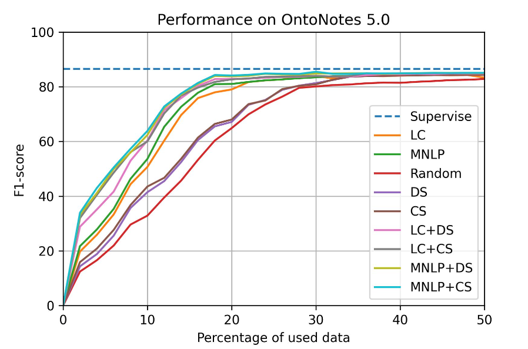
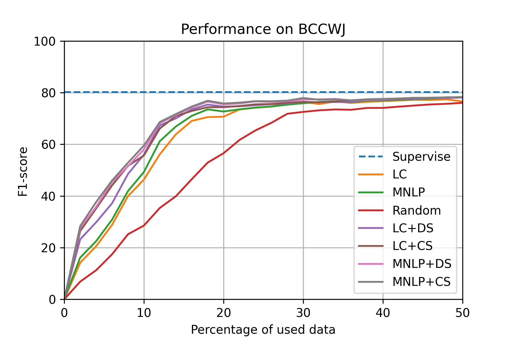
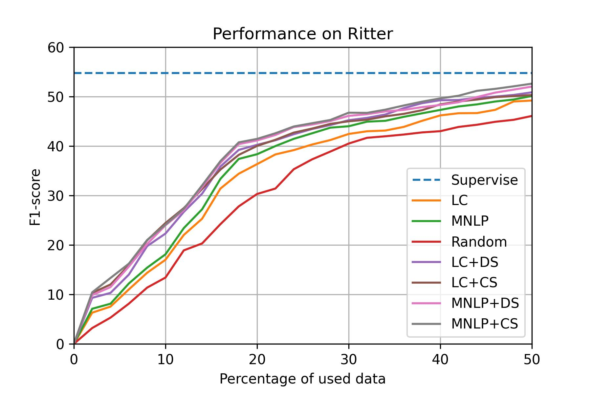

# Performance

We will show the performance of SeqAL on different datasets with different language.

- **Supervise** means that training model on full data
- **LC** (Least confidence) and **MNLP** (Maximum Normalized Log-Probability) are query algorithm with different calculation on informativeness. 
- **Random** means randomly query data without caring about informativeness.
- **CS** and **DS** are the diversity based sampling methods for NER

We first train the model on seed data (2% of training data). Then we query 2％ of training data in each iteration untill 50% data are queried.

## SeqAL on different languages

### Ontonotes 5.0 (EN)

**Setup**

- dataset: CoNLL 2003(English)
- model: Bi-LSTM CRF
- total query data: 50%
- epochs: 20
- batch_size: 32
- learning_rate: 0.015
- embeddings: bert-base-uncased
- GPU: AWS p3.8xlarge

### BCCWJ (JP)

**Setup**

- dataset: BCCWJ
- model: Bi-LSTM CRF
- total query data: 50%
- epochs: 20
- batch_size: 32
- learning_rate: 0.015
- embeddings: bert-base-japanese 
- GPU: AWS p3.8xlarge

### People's Daily 2014 (CN)

**Setup**

- dataset: People's Daily 2014
- model: Bi-LSTM CRF
- total query data: 50%
- epochs: 20
- batch_size: 32
- learning_rate: 0.015
- embeddings: bert-base-chinese 
- GPU: AWS ml.p3.8xlarge

## SeqAL on different domain

### Ritter (SNS)

**Setup**

- dataset: Ritter
- model: Bi-LSTM CRF
- total query data: 50%
- epochs: 20
- batch_size: 32
- learning_rate: 0.015
- embeddings: bert-base-japanese 
- GPU: AWS g4dn.2xlarge

