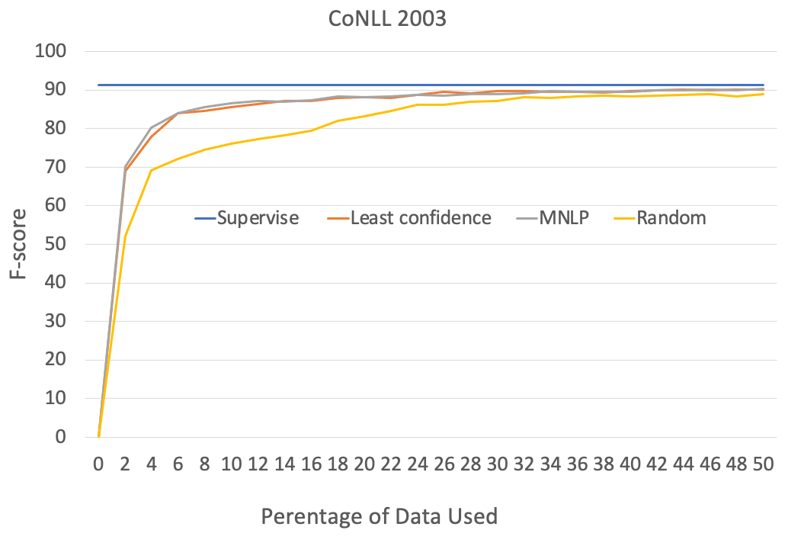

# Performance

- Setup:
  - CoNLL 2003
  - total query data: 50%
  - batch_size: 16
  - learning_rate: 0.015
  - embeddings: glove.100d

- Each iteration:
  - query 2% data
  - 25 epoches

### Time cost

With GPU:
- Each epoches: about 8s
- Each iteration: about 5min 
- 25 iterations: about 4hr

### F1 score

30% of data can achieve 88.57 f1-score.

